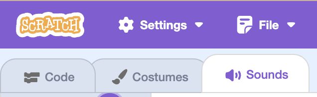
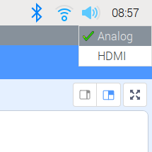

## Playing some tunes

Now you have a disco effect, it's time to make your MP3 player play some tunes!

--- task ---
Gather a few MP3 files together to begin with — you'll want a minimum of three. Save them in the same directory as your Scratch code.
--- /task ---

--- task ---
Click on the **Sounds** tab for your sprite.

--- /task ---

--- task ---
Use the **Upload sound from file** button to upload all your MP3 files.

--- /task ---

You should now see your tracks uploaded in Scratch

--- /task ---

--- task ---
Now it's time to play your tracks. You can play a sound using the `start sound`{:class="block3sound"} block. Add this block above your `forever`{:class="block3control"} loop.

```blocks3
when flag clicked
start sound [track_01 v]
forever
set pixel x (pick random (0) to (7)) y (pick random (0) to (7)) to (pick random (-100000) to (100000)) ::extension
```
--- /task ---

--- task ---
Now click on the green flag to play your track as the disco lights start. Make sure you have speakers or headphones plugged into your Raspberry Pi. You might also need to change the sound output to **Analog** by right-clicking on the speaker icon in the header bar of the desktop and then clicking this option.

--- /task ---

