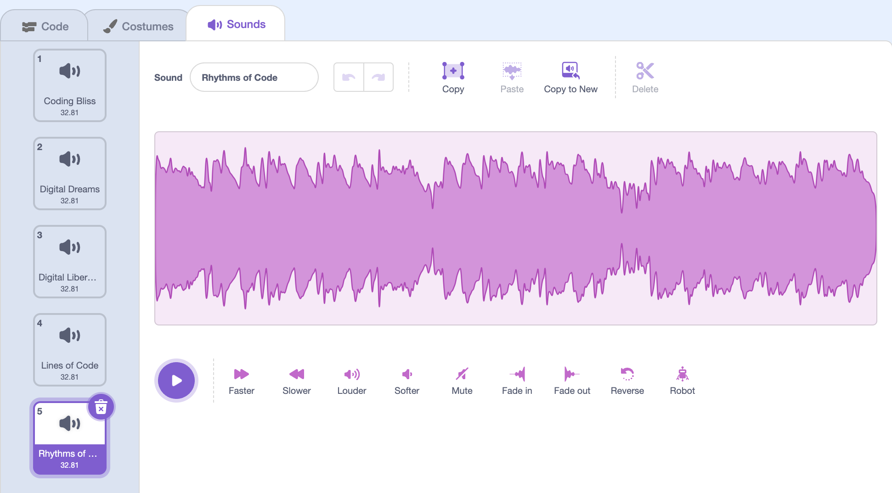

## Playing some tunes

Now you have a disco effect, it's time to make your MP3 player play some tunes.

--- task ---
Gather a few MP3 files together to begin with, you'll want a minimum of three. Save them in the same directory as your Scratch code.
--- /task ---

--- task ---
Click on the **Sounds** tab for your sprite and use the **Upload sound from file** button to upload all your MP3 files.

--- /task ---

--- code ---
---
language: python
filename: test.py
line_numbers: true
line_number_start: 3
highlight_lines: 4-5,7
---
while True:
    print('hello')
	if thing == 1:
	    print('hello')
	else:
	    print('goodbye')
--- /code ---

