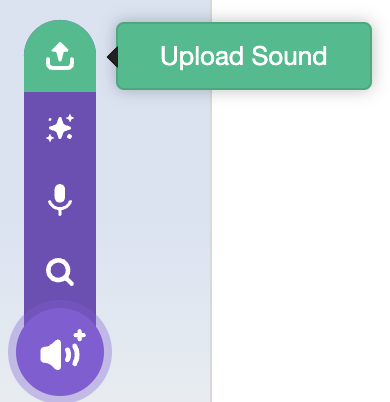

## Playing some tunes

Now you have a disco effect, it's time to make your MP3 player play some tunes!

--- task ---
Gather a few MP3 files together to begin with — you'll want a minimum of three. Save them in the same directory as your Scratch code. 

Some example songs are provided for you to [download here](https://rpf.io/p/en/sensehat-scratch-mp3-player-go) - these mp3s were created with the free online AI tool [Udio](https://www.udio.com/). 

--- /task ---

--- task ---
Click on the **Sounds** tab for your sprite.

--- /task ---

--- task ---

Delete the sound effects already on your sprite by clicking the small trash icon on each thumbnail:


--- /task ---

--- task ---
Use the **Upload sound from file** button to upload all of your MP3 files.


--- /task ---

--- task ---

Select all the files you want to upload in the window that appears and click **Open**.

--- /task ---

You should now see your tracks uploaded in Scratch.
![The Scratch interface in the "Sounds" tab, displaying a sound editing area. A list of sound clips on the left includes "Coding Bliss," "Digital Dreams," "Digital Liberation," "Lines of Code," and "Rhythms of Code," with "Rhythms of Code" selected. The main area shows the waveform of "Rhythms of Code" in purple. Editing tools above the waveform include options for copy, paste (grayed out), copy to new, and delete. Playback controls below the waveform include play, faster, slower, louder, softer, mute, fade in, fade out, reverse, and robot effects.](images/sounds.png)

--- task ---
Now it's time to play your tracks! Play a sound using the `start sound`{:class="block3sound"} block. Add this block above your `forever`{:class="block3control"} loop:

```blocks3
when flag clicked
+start sound [Coding Bliss v]
forever
set pixel x (pick random (0) to (7)) y (pick random (0) to (7)) to (pick random (-100000) to (100000)) ::extension
```
--- /task ---

--- task ---
Test your code.

Click on the green flag to play your track as the disco lights start. 
--- /task ---

--- collapse ---

---

title: I can't hear anything

---

Make sure you have speakers or headphones connected to your Raspberry Pi. 

You might also need to change the sound output to **Analog** by right-clicking on the speaker icon in the header bar of the desktop and then clicking on this option.


--- /collapse ---

