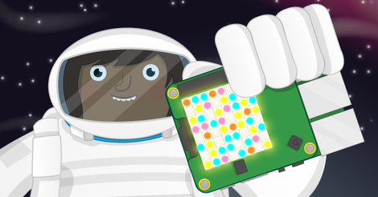

## What can you do now?

Try our [Random Sparkles](https://projects.raspberrypi.org/en/projects/sense-hat-random-sparkles) project, which is a great introduction to using python with your SenseHAT!

--- no-print ---

<iframe src="https://trinket.io/embed/python/55af2b45f5?outputOnly=true&runOption=run" width="100%" height="600" frameborder="0" marginwidth="0" marginheight="0" allowfullscreen></iframe>

--- /no-print ---

--- print-only ---

--- /print-only ---

Or, you can have a look at the [Physical Computing with Scratch Pathway](https://projects.raspberrypi.org/en/pathways/physical-computing-with-scratch-and-the-raspberry-pi), where you will make input and output electronics with Scratch and your Raspberry Pi computer!

If you want to have more fun exploring Scratch, then you could try out any of [these projects](https://projects.raspberrypi.org/en/projects?software%5B%5D=Scratch).
